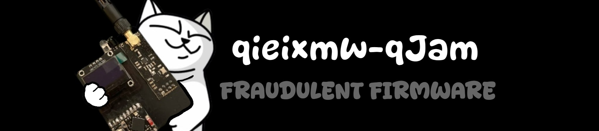
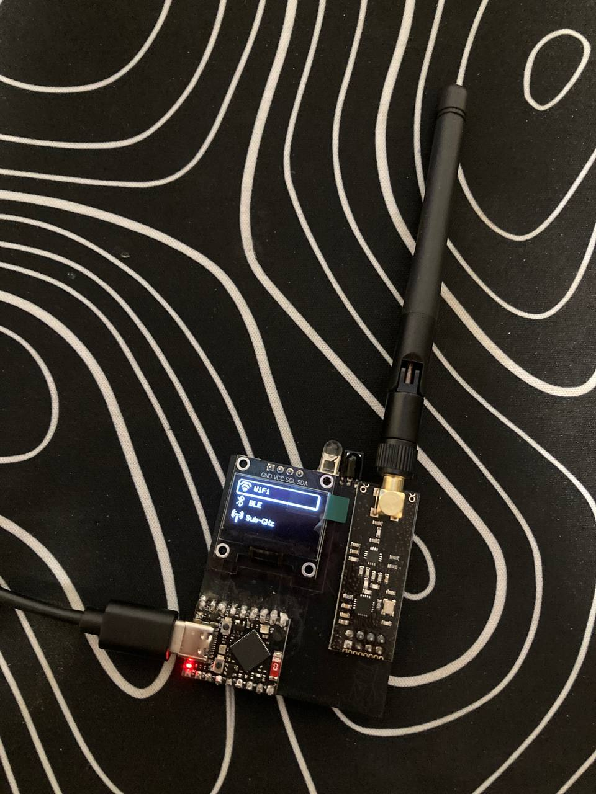

# 😻 qieixmw-qJam

qieixmw-qJam is a universal ESP32 firmware that has many offensive features.
For now it only supports regular ESP32's, soon there will be more support for more devices.

# 🔗 How to install

### Easiest way to install is to use my Web Flasher!
### Link: https://qieixmw.github.io/flasher (SOON)
Alternatively, you can download the latest binary from releases or actions and flash locally using esptool.py.
```sh
esptool.py --port COM0 write_flash 0x00000 qieixmw-qJam-<device>.bin
```

# ❔ How does it look and why?

qieixmw-qJam has a observation within the community to focus on devices like Flipper Zero. While these devices offer to penetrate into the world of offensive security,
there is a obvious sense that their functions could be archieved without being that overpriced.



# 🚨 Disclaimer

qieixmw-qJam is a tool for cyber offensive operations, distributed under the terms of the Affero General Public License (AGPL). It is intended for legal and authorized security testing purposes only. Use of this software for any malicious or unauthorized activities is strictly prohibited. By downloading, installing, or using qieixmw-qJam, you agree to comply with all applicable laws and regulations. This software is provided free of charge, and we do not accept payments for copies or modifications. The developer of qieixmw-qJam assume no liability for any misuse of the software. Use at your own risk.

# 🖍️ Credits
To MonoBank for the QR-Cat


